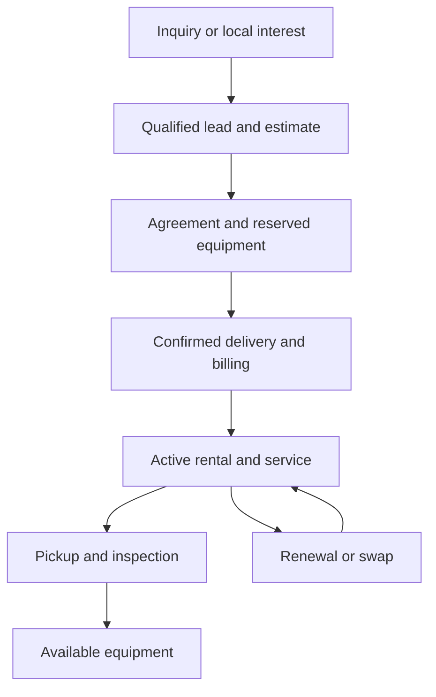

# Appliance Desk: complete product and UI/UX overhaul specification

Version 1.0 — 2026-09-30. **Planning deliverable, not implemented.**
Read AGENTS.md first. Execution is in TASKS.md; use IMPLEMENTER.md as the
small-model prompt. Owner decisions are in ../../OWNER-INPUTS.md.

## 1. Outcome and boundaries

Make Appliance Desk a coherent operating workspace for a small appliance
rental business: Chris should know what needs attention, find the complete
customer story, and finish common jobs without navigating a long list of
unrelated pages. Customers should understand their rental, next visit,
payment status and how to get help. Prospects should see a credible local
business and one clear next step appropriate to launch status.

This is an incremental overhaul of the existing Next.js/Prisma application,
not a replacement CRM, general SaaS platform, framework migration, or new
microservice architecture. Preserve the Evergreen identity, working billing,
inventory transitions, and manual approval of orders/scheduling. The user
requested the design and implementation plan in this turn; this document is
not authority to deploy all proposed changes or incur costs.

Evidence: main f0fa03c5cf6fb205e208fa1ea964efb1681f02fe, plus the unmerged
prelaunch PR #86. Inspected source, schema, business rules and previous review
notes. Public prelaunch homepage and form were visually inspected in browser.
Owner/customer layouts below are source-based findings, not a claim of a new
live signed-in usability test. Historical reviews describe several features
that have since shipped; they are not a missing-feature checklist.

## 2. What exists and what changes

| Area | Existing evidence | Treatment |
|---|---|---|
| Daily work | `/desk/today`, exceptions, tasks, dashboard | Unify presentation; add filters and task panel, not another competing dashboard |
| CRM | Lead/Customer, notes, contacts, lost reasons, source counts, staff tasks, customer timeline | Add bounded follow-up ownership, coherent record tabs and communication visibility |
| Estimates | Creation, approval, deposits, follow-up, conversion | Preserve; make next step and blockers obvious |
| Rentals | Four-step builder, signatures, reservation holds, assignment, lifecycle actions | Preserve domain/actions; clarify milestones and draft resume |
| Dispatch | Day/week/agenda, unscheduled queue, advisory two-hour conflicts, driver view | Add real duration/assignee fields when needed; improve compact/mobile presentation |
| Equipment | Individual appliances, guided actions, QR, condition photos, history and profitability | Improve record layout and lifecycle clarity; do not rebuild inventory |
| Purchasing | Suppliers, purchase orders, partial receiving, parts stock | Improve navigation and low-stock visibility; no autonomous purchasing |
| Money | Stripe test mode, deposits, recurring billing, invoices, manual payments, credits/refunds, statements | Reconcile existing records in a clear workspace; no second ledger |
| Customer portal | Rentals, visits, maintenance/photos, billing, account settings | Task-first home and understandable progress; retain customer isolation |
| Website | Pricing, service area, contact, editable business settings, content records, brand assets | Organize owner editing; keep claims accurate, separate drafts from publishing |
| Automation | Billing/job reminders, late fees, backups, estimate follow-up; PR #86 welcome series | Visibility, durable run history and safe recovery; no generic visual workflow builder |
| Growth | Referral, churn/utilization and source/conversion reporting | Accurate definitions and action links; distinguish source counts from ROI |
| Infrastructure | GitHub CI, Vercel, Neon, Blob, Resend, Sentry, role checks | Strengthen preview isolation and operational diagnostics; reuse stack |

Specific design debt: 23 flat owner links in `desk/layout.tsx`; mixed
semantic tokens and global Tailwind color overrides; customer detail is a
long stacked page; settings mixes prices, staff and public identity; Today
and dashboard divide related context. The design guide still describes a
superseded palette even though globals.css implements Evergreen v2.0.

## 3. Product rules that must survive every redesign

- Inquiry, subscriber, customer, agreement, equipment assignment, delivery,
  invoice and payment are distinct facts. Do not collapse them into one status.
- `LeadStatus` remains NEW / CONTACTED / CONVERTED / LOST initially.
  “Quote pending” is a derived filter from Estimate, not a new lead enum.
  Conversion is a guarded action, never a board drag that creates accounts.
- Billing starts according to existing delivery-based rules, not signature
  or an attractive progress indicator. Keep provider-confirmed finance truth.
- Returned equipment requires the existing inspection process before reuse.
- No broad CRUD forms that bypass lifecycle actions or inventory exclusivity.
- Server permission checks apply to pages, actions, exports, search, counts,
  timeline entries and any cached aggregates—not just menu visibility.
- Maintenance is included. Public delivery/install statements cannot imply
  universal free service. No fabricated reviews, inventory or performance.
- The owner approves rentals and schedules at launch. No customer self-booking,
  auto-charges, auto-refunds, auto-contract changes or unsupervised outreach added.
- Price/business rules remain database-driven and documented in BUSINESS-RULES.

## 4. Navigation and information architecture

Keep existing URLs. Organize links into expandable sections; active section
expands automatically. Use text labels with existing service icons. Overview
pages are only added where they answer a question not already answered.

| Navigation section | Children / existing destinations | Access |
|---|---|---|
| Today | Today, Tasks | Staff roles; role-safe aggregates |
| Customers & sales | Leads, Customers, Estimates, Agreements | Preserve each route's existing guard; Estimates remain owner/admin |
| Service | Dispatch, Jobs, Maintenance, Driver view | Existing operational access |
| Equipment | Inventory, Fleet, Parts, Purchase orders, Suppliers | Purchasing/suppliers retain owner/admin guard |
| Money | Billing, Revenue, Reports | Owner/admin |
| Growth | Growth signals, Launch list (after PR #86) | Owner/admin |
| Settings | Business configuration; Activity as a utility link | Settings owner/admin; Activity existing guard |

Dashboard becomes “Business overview” under Money/Reports, still reachable
at `/desk/dashboard`. Today stays the default. Do not delete old destinations
or break bookmarks during navigation changes.

Desktop >=1024px: 240px sidebar, independently scrollable navigation; 64px
header with search, context title and one Create menu. Content uses available
width up to 1440px. Main is `min-width:0`; tables scroll inside a container.
Tablet 768–1023px: collapsible drawer, full label text when open; no cryptic
icon-only primary navigation. Phone <768px: 56px header and accessible menu;
Today / Tasks / Jobs / More bottom shortcuts, role-filtered; add bottom safe
padding so controls never obscure content. Driver view remains focused.

Search retains normal GET URLs. Later extend the current bounded search to
addresses, agreements and invoices only with server-side role filtering.
Keep focus visible, close drawers with Escape, restore focus to their trigger,
and highlight exactly one active route. Skip link targets the page content.

## 5. Visual language and component specification

Keep Manrope and current logo assets; no rebrand or replacement illustrations.
Use `globals.css` as the implemented token authority and the Evergreen kit
for provenance. Migrate touched pages to semantic tokens gradually; retain
legacy overrides until all their callers are migrated.

| Semantic role | Light treatment | Dark treatment |
|---|---|---|
| Canvas | Existing ivory `#F7F5EC` | Existing dark canvas token |
| Surface | Existing white surface | Existing dark surface token, with visible border |
| Text | Ink `#17251E`, muted `#4E6658` | Existing light ink/muted tokens; verify contrast |
| Primary action | Evergreen `#123C2D`, white label | Explicit action fill/on-action pair; never a pale fill with white text |
| Accent | Fresh `#B9E66B`, Evergreen text | Restrained accent; avoid large neon backgrounds |
| State | Existing StatusBadge tone + icon + label | Same meaning with tested dark pairs |

Scale: spacing 4/8/12/16/24/32/48px. Operational page title 28px/36,
section title 18px/26, body and forms 16px/24, dense table text 14px/20,
metadata >=12px/18. Public marketing headings may be larger. Money is
right-aligned with tabular numerals. Cards radius12, fields/buttons radius8;
reserve pill styling for badges/marketing CTAs. Border-first separation;
subtle shadows only for overlays, not every panel. One prominent action per
page or workspace section, 1–2 secondary actions, remaining actions in a
labelled menu. Destructive actions separated, with impact and recovery copy.

Shared components to implement/reuse:
- PageHeader(title, description, breadcrumb, primaryAction, secondaryActions).
- SectionCard(title, description, actions), Metric(label, value, basis, href).
- FilterBar(URL-based), RecordTabs(link-based), ResponsiveRecordList.
- EmptyState(next step), ErrorState(retry), PendingButton, FormField and
  FormErrorSummary; existing StatusBadge/Pagination/PhotoUploadField remain.
- ActionPanel for short actions; full route for complicated forms. No new
  drawer/dialog library unless an accessible need cannot be met otherwise.

State contract: skeleton reserves space, empty explains a real next action,
validation preserves input and focuses error summary, failed save cannot show
success, double-submit is disabled and also guarded server-side. “Saved” only
after server confirmation. Disconnected is not “saved offline.”

WCAG 2.1 AA is the existing required baseline; adopt >=44px touch targets as
product guidance. Test 360/768/1440px, 200% zoom, keyboard, light/dark,
reduced motion and long content. No body-level horizontal scroll; tables may
have a labelled local scroll region. Do not trade readable labels for density.

## 6. Screen blueprints

### Today: an action workspace

| Region | Content / behavior |
|---|---|
| Header | Today; full date in America/Denver; Create rental, secondary Add task |
| Compact summary | Jobs today, overdue follow-ups, open service requests; money only for authorized users |
| Main 8 columns | Needs attention, sorted severity then age; explicit “Review invoice”, “Schedule visit”, “Inspect return” actions instead of repeated vague “Fix this” |
| Side 4 columns | Today's chronological schedule; owner tasks due/overdue; collapsed completed work |
| Owner-only setup | Remaining launch inputs linked to their settings; no claims that a value is verified merely because nonempty |
| Empty | “Nothing urgent. View upcoming jobs or follow up with a lead.” Never fake metrics |

At phone widths: urgent exceptions, next visit, due tasks, remaining schedule.
Do not add a persistent copy of every exception initially; derive from existing
records. Persistent snooze/assignment can come later if real workload needs it.

### Leads and follow-up

Default list with New / Contacted / Converted / Lost filters plus derived
“Quote awaiting reply” and “No next task.” Optional board only after list is
excellent; keyboard buttons must match any drag behavior. Columns: contact,
city, need/quantity, source, stage, last activity and next follow-up. Do not
put sensitive notes in list previews. Filters in URL, 25 rows/page.

Lead detail: identity + next action, requested appliances/location, timeline
and notes, next task, estimates. Quote and conversion call existing guarded
actions. Lost requires existing reason. Suspected duplicate is a warning
link—never auto-merge people or accounts.

### Customer workspace

Header: name/company, contact shortcuts, account status, one primary action
(Create rental) plus Schedule visit/New estimate in secondary menu. Tabs:
Overview / Properties / Rentals / Service / Billing / Activity. Keep tab in
URL. Overview: next job, outstanding needs, current rentals, primary contact.
Billing is loaded only for authorized roles; do not fetch then hide it.
Notes distinguish internal notes from messages actually sent. Timeline has
entity links, author, timestamp and filter; paginate rather than silently
making the most recent100 entries look like complete history.

Properties reuse ServiceAddress and CustomerContact. Unit/apartment lives in
existing address structure unless IN-14 proves a separate hierarchy is needed.
Never equate contact person with the signed-in payer or grant portal access
just because an email was added as a contact.

### Rental builder and agreement detail

Keep four steps; expose a visible stepper and compact price summary. Select
customer/property -> term/fees -> appliances -> review/send. On review show
monthly/one-time/prepaid amounts separately, term vs billing cadence, and
missing prerequisites. Resume existing draft from the agreement; do not invent
browser-local financial drafts. Explicit save checkpoints with safe retry.
Agreement detail shows independent Signature / Payment requirement /
Equipment / Delivery / Billing facts; a “Next step” panel explains blockers.

### Dispatch, maintenance and field work

Default agenda on phone, day view on desktop. Unscheduled queue remains
visible. Job cards show time window, type, city/property, assigned person,
equipment and preparation state. Reschedule through an explicit form with
impact preview; drag-and-drop is deferred. Existing two-hour conflict
assumption must be labelled until real duration is implemented.

Driver page: address and existing maps link, access instructions, appliances,
checklist, photos, notes, then completion action. Do not cache access codes or
customer records offline. Connectivity failures preserve unsent form state
and say what has not synced. Completion consequences use existing lifecycle
logic, not client-side status changes. Changing mandatory checklist rules
requires a business decision; this design does not change today's advisory rule.

Maintenance queue: Submitted / Triage / Scheduled / In progress / Resolved
are display groups mapped to existing enums and jobs, not new states invented
by UI. Show request age, urgency and linked job. Customer sees clear progress
and response expectations only when approved; do not fabricate service SLAs.

### Appliance and purchasing workspaces

Appliance header: asset ID, type/model, condition, availability, current
location, primary lifecycle action. Tabs: Overview / History / Photos /
Costs & earnings / Parts. Earnings labels must state estimates vs collections.
Guided reserve/swap/return/inspection actions remain authoritative. QR links
must still require authentication for private records.

Parts list: on hand, reserved if supported, supplier, reorder point if set,
and proposed reorder quantity. No fabricated stock valuation. “Create draft
purchase order” never places an order. Receiving stays bounded by outstanding
quantity; repair consumption must not be counted twice. Use existing purchasing
business rules before adding replenishment thresholds.

### Money and reporting

Billing default: outstanding balances, failed/pending synchronization, upcoming
charges. Customer statement remains the source for actual invoice history.
Separate deposit liability/credit/refund from rental revenue. Never relabel
cash received as profit. Reports show date basis, denominator, missing-cost
warnings and drill-through to records. “Lead source conversion” is not “ROI”
without attributable spend and collected-revenue definitions. No new accounting
integration or consolidated charge engine in the first releases.

### Customer portal

Home answers: what do I rent, what happens next, do I owe anything, how do I
get help? Show next visit, most relevant rental/property and prominent Report
a problem. Billing uses existing portal/Stripe actions; request pickup does
not silently cancel agreement or charges. Property managers get an address
filter, not access to another customer's data. Internal notes never leak into
the portal. Keep Overview / Rentals / Maintenance / Billing / Settings.

### Owner configuration and website

Split settings navigation into Business profile / Service area / Products &
pricing / Rental policies / Website / Notifications / Staff / Integrations.
Reuse current fields and validation. Section-specific saves avoid resetting
unrelated values. Show last change and audit link. Secrets stay in deployment
configuration; UI shows configured/test/disabled status without revealing keys.

Website editor: bounded fields for approved page sections, FAQs, images/alt,
contact details, SEO title/description and service-area facts. Preview draft,
explicit publish, retain previous version for rollback. Do not build a drag-and-
drop CMS. Prices come from catalog, not duplicate copy fields. Public lifecycle
is prelaunch vs open; only confirmed opening data changes copy. Household and
property-manager paths use existing contact/estimate workflows, not separate
CRMs. City pages require real useful local content; no mass doorway pages.

## 7. Technical and data contracts for new capabilities

Retain App Router Server Components, existing server actions, Zod, domain
modules, Prisma/Postgres, provider integrations and CI. No new ORM/state/store
library. Use domain queries for all record summaries. Select small DTOs and
paginate with stable order (timestamp + id); avoid N+1 calls per row.

| Proposed change | Minimal contract | Guard / migration treatment |
|---|---|---|
| Task assignment | StaffTask optional assignedToUserId, priority, updatedAt/version; existing rows stay unassigned, not fabricated assignments | Authorized staff selector; server checks role and record scope; optimistic conflict check; audit |
| Task views | Mine / Unassigned / Team, due filters | Existing tasks are shared today; changing private/team visibility is an explicit decision, not an accidental regression |
| Job capacity | Optional assignedToUserId, durationMinutes, version | Null preserves existing two-hour advisory fallback; validate active staff and positive bounded duration |
| Replenishment | Optional reorderPoint and preferredSupplier on existing parts | No auto-order; null means no alert; business meaning documented before UI |
| Run history | AutomationRun(ruleKey, runKey unique, environment, start/end, state, sanitized counts/error) | OWNER/ADMIN reads; no credential/message-body dumps; missing run != successful zero work |
| Outgoing messages | MessageDelivery with unique business idempotency key, provider ID, state and approved purpose/recipient reference | Provider acceptance != delivery; no blind retry after unknown outcome; marketing suppression checked immediately before send |
| Provider events | Unique provider event ID, signature verified before storage, monotonic/safe state reconciliation | Spoof/replay/late-event tests; unsubscribe and complaint suppression take precedence |
| Website revisions | Bounded SiteContent draft/published revisions with editor/version metadata | No editable arbitrary scripts; publish validation; rollback republishes prior approved content, not DB restore |
| CSV imports (later) | ImportBatch + stable row key only if needed for resume; parser produces preview/errors first | No implicit customer invites, email, bulk status bypass or overwrite; confirm batch and commit in bounded transactions |

These are schema design constraints, not ready-made SQL. Sol must compare the
current schema and write a migration per data task; review indexes, constraints,
backups and empty-database upgrades before a lighter model builds its UI.
Add nullable columns/defaults; no destructive rewrite or forced backfill.
Prefer database-enforced uniqueness for competing operations. Every new table
must be included in backup/export/restore manifests and schema-health checks.

Communication integration should wrap existing senders progressively. Do not
replace PR #86's launch ledger while adding general run history; its finite
sequence and suppression behavior remain covered by the same tests. Existing
provider dedupe semantics must survive wrapper introduction. Start with one
low-risk reminder; migrate each financial or marketing sender in a separate PR.

Preview isolation is the first infrastructure task: current previews share
production DB. Use a project-specific test Neon branch and preview-only env
values, test Stripe, isolated private files and non-sending notification mode.
Do not run fixtures or reset scripts against production. No new paid resource
or deletion without approval. A runtime-only block is insufficient if build
scripts can run migrations against production. Protect build and runtime.

## 8. Workflows to preserve and demonstrate

The arrows describe navigation/guarded business processes, not automatic
conversion of every record. Subscribers only become leads through an explicit
qualified inquiry; never invent missing phone numbers or enroll them in SMS.

Demonstration scenarios: household rental; multi-property estimate with deposit;
failed payment/provider retry; maintenance/photo/job/swap; pickup/inspection;
lead lost with reason; lead follow-up; customer A attempts customer B URL;
staff attempts finance export; draft website publish/rollback; failed cron.
Use synthetic fixtures in isolated environments only. Existing tests remain.

## 9. Release order and definition of success

| Release | Goal | Tasks | Owner dependency |
|---|---|---|---|
| A — foundation | Document truth, safe preview, role checks, design primitives | O00–O05 | Review architectural preview changes only when they require access/cost |
| B — daily use | Today, customer, lead, tasks, property context | O06–O11 | IN-12 preview feedback; contact answers do not block development |
| C — rental operations | Builder, job capacity, dispatch, equipment, purchasing | O12–O17 | Preserve current policies; new staffing detail only if used |
| D — money and customer experience | Billing presentation, reports, portal, settings | O18–O21 | IN-08 remains separate from UI release |
| E — controlled growth | Content editing, run history, message visibility, events, imports | O22–O29 | Marketing activation IN-01/02/05; imports only when needed |
| F — hardening and launch | Scenario verification, performance and owner handoff | O30–O31 | Relevant launch inputs, manual review, explicit release approval |

Fastest useful stopping point: release B. Do not delay an easier daily desk
until optional imports, replenishment or broader campaigns are done. Each
release ends with working preview, evidence, HANDOFF update and owner report.
Each card is NOT_STARTED initially, not a feature claimed complete.

Success targets (acceptance targets, not measured current claims): find a
known customer in <=2 navigation actions after search; open the next due job
from Today in one action; start a maintenance request from portal home in one
action; create a routine rental without re-entering an existing customer's
address; all displayed metrics trace to a defined query; no sideways page
scroll at 360px; no lost form fields on a validation/server error.

Performance: establish baseline first. Test isolated synthetic datasets of
100/1,000 customers and 1,000/10,000 appliances before calling it scalable;
these are evaluation tiers, not a sales promise. Target p95 server query time
<500ms on ordinary list pages and no unbounded list payload; investigate a
>20% regression on the same environment/fixture. Use measured hosting limits
before queues, caches or higher tiers. Keep PII out of telemetry.

## 10. Deferred by deliberate choice

Customer self-scheduling, fleet route optimization, multiple warehouses,
full email inbox sync, accounting/payroll replacement, customizable pipeline
enums, generic custom fields, visual automation builders, offline financial
writes, expanded employee permission system, consolidated Stripe charges and
multi-industry features. Revisit only with a real use case, explicit scope,
and the specific owner input—not because the interface makes them look easy.
